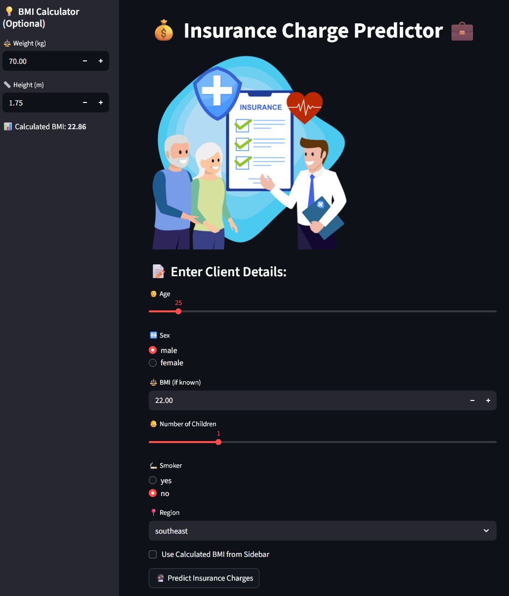

# 🏥 Medical Insurance Charge Predictor 💰

A machine learning project that predicts medical insurance charges based on user health and lifestyle inputs. The best model is deployed via a **Streamlit** app for interactive charge prediction.

---

## 📌 Project Overview

This project evaluates multiple regression models to predict medical insurance charges for individuals. The most accurate model is deployed using a simple and intuitive Streamlit UI.

- 📓 Training & analysis done in `notebook.ipynb`
- 🧠 Best model (`Random Forest`) saved as `model.pkl`
- 📊 Preprocessing/scaling handled (if applicable)
- 🌐 Web app built in `app.py`
- 🎨 Visual branding/image: `insurance.png`

---

## 🚀 Getting Started

### 1. Clone the Repo

```bash
git clone https://github.com/your-username/insurance-charge-predictor.git
cd insurance-charge-predictor
```
### 2.Install Dependencies
```bash
pip install -r requirements.txt
```
### 3. Run the Streamlit App
```bash
streamlit run app.py
```
## 🛠 Tools & Technologies Used

### 📊 Machine Learning & Data Processing

- Python 3.12  
- Pandas  
- NumPy  
- Scikit-learn  
- XGBoost  

### 📉 Modeling Techniques

This project compares the performance of several regression models to predict insurance charges. Feature scaling is applied where necessary, depending on the model.

Evaluated algorithms include:

- **Linear Regression**
- **Ridge Regression**
- **Lasso Regression**
- **ElasticNet Regression**
- **Random Forest Regressor**
- **XGBoost Regressor**
- **Gradient Boosting Regressor**

**Evaluation Metrics**:

- Mean Absolute Error (MAE)  
- R² Score (Coefficient of Determination)

> 🔍 **Note:**  
> Tree-based models used **raw features**, while linear models were trained on **scaled features** for improved performance.

### 📈 Visualization

- Matplotlib  
- Seaborn  

### 🌐 Web App & Deployment

- Streamlit – for the interactive frontend  
- Joblib / Pickle – for model and scaler serialization  

### 🧪 Development Tools

- Jupyter Notebook  
- VS Code  

### 📜 Licensing

- MIT License

---

## 💡 How to Use the App

Once the app is running:

1. Enter the client's details:
   - Age  
   - Sex  
   - BMI  
   - Number of children  
   - Smoker status (yes/no)  
   - Region  
2. Click the **Predict Insurance Charges** button.
3. The app will display the estimated medical insurance cost using the trained **Random Forest** model.

---

## 🧠 Model Training Workflow

The training pipeline in `notebook.ipynb` includes:

- Data loading and preprocessing  
- Exploratory Data Analysis (EDA)  
- Feature engineering (encoding categorical variables)  
- Model training and comparison  
- Evaluation using MAE and R²  
- Saving the best-performing model for deployment  

---

## 🖼️ Streamlit UI Preview

<!-- Uncomment and replace the link below if deployed -->
<!-- Visit the live app: [https://your-insurance-app.streamlit.app/] -->



---

## 📄 License

This project is licensed under the **MIT License**.  
See the [`LICENSE`](LICENSE) file for more details.

---

## 👤 Author

**Vishal Gupta**  
GitHub: [@vishalgupta-git](https://github.com/vishalgupta-git)
